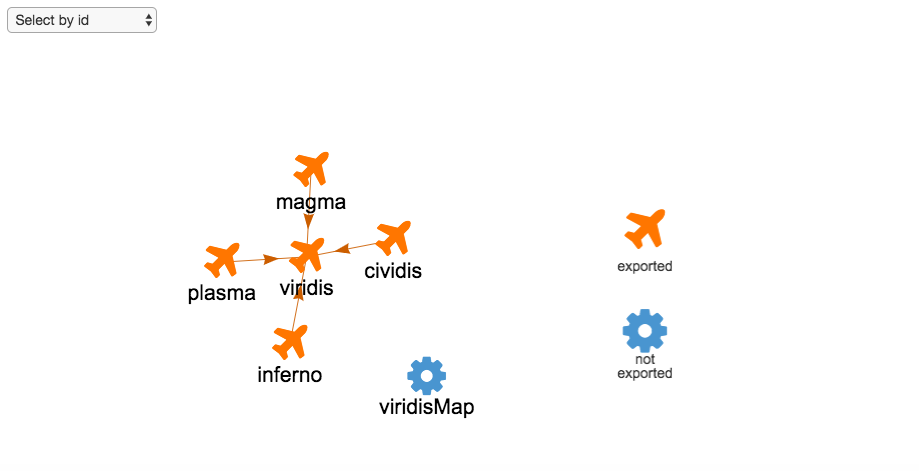

Packages are the basic building blocks of the entire R ecosystem. They are the primary form in which we bundle up functions, data, help files, vignettes, and other pieces information that make it convenient to share code among users. While using a package is relatively straightforward, understanding what's going on under the hood may not be. Yet this understanding is crucial to a number of important tasks, such as contributing to the development of a package, or reviewing its quality. 

`pkginspector` is part of a larger effort by rOpenSci to develop tools to make it easier to comprehend as well as evaluate a package's contents. In fact, with guidance from Noam Ross, this project began during unconf18 as part of the `pkgreviewr` package, and was spun off after the conference since it contains a unique set of tools that are helpful not only for reviewers but for developers as well.

The package focuses on facilitating a few of the many tasks involved in reviewing a package. (For more on rOpenSci's review process, see the blog post: ["Onboarding at rOpenSci: A Year in Reviews"](https://ropensci.org/blog/2016/03/28/software-review/) and the e-book [*rOpenSci Packages: Development, Maintenance, and Peer Review.*](https://ropensci.github.io/dev_guide/)) Specifically, we build tools to analyze and visualize function dependencies, and to analyze function parameters within a package:

### Function calls

The workhorse function to analyze function calls is `rev_fn_summary()` which takes a package path and returns a table of information about its functions. We demonstrate here, with a simple package, `viridisLite`, which is included with `pkginspector` for demo purposes:


```r
#devtools::install_github("ropenscilabs/pkginspector")
library(pkginspector)
pkgdir <- system.file('viridisLite', package = 'pkginspector')
rev_fn_summary(pkgdir)
```

```
##       f_name
## 1    cividis
## 2    inferno
## 3      magma
## 4     plasma
## 5    viridis
## 6 viridisMap
##                                                                     f_args
## 1               cividis (n, alpha = 1, begin = 0, end = 1, direction = 1) 
## 2               inferno (n, alpha = 1, begin = 0, end = 1, direction = 1) 
## 3                 magma (n, alpha = 1, begin = 0, end = 1, direction = 1) 
## 4                plasma (n, alpha = 1, begin = 0, end = 1, direction = 1) 
## 5 viridis (n, alpha = 1, begin = 0, end = 1, direction = 1, option = "D") 
## 6      viridisMap (n = 256, alpha = 1, begin = 0, end = 1, direction = 1, 
##   calls called_by dependents
## 1     1         0          0
## 2     1         0          0
## 3     1         0          0
## 4     1         0          0
## 5     0         4          4
## 6     0         0          0
```

We learn that the first four functions call one function a piece, and are not called by any other functions in the package. `viridis()`, in constrast, doesn't call any functions but is called by four other functions. In this case, the number of "dependents" is also four. Dependents are counted recursively and include any functions in the calling chain. For example, if A calls B and B calls C, we would say that C is called by 1 (B) but has 2 dependents (A & B). `rev_fn_summary()` also provides information about function parameters in the `f_args` column.

*What's not working:* We know that we miss function calls if they are passed as parameters to `purrr::map()` and `do.call()` functions. There may be other systematic misses as well.

### Visualization

We provide a means to visualize the function structure with `vis_package()`. We believe that presenting the same information in multiple ways gives the user options. Depending on the situation, a table or a network graph may be more useful.  


```r
vis_package(pkgdir, physics = FALSE)
```


<!--- this link will be changed for the final draft per instructions --->


To create the visualizations, we use `visNetwork`, a R implementation of the JavaScript vis.js library. More details on `vis_package()`, including interactive examples, can be found [here](http://rpubs.com/jtr13/vis_package).

### Argument default usage

Finally, the `rev_args()` function identifies all the arguments used in the functions of a given package. Its main feature is a logical vector indicating if the default value of the argument is consistent across all uses of the argument. The idea is that this information can be useful to a reviewer because it is a proxy of the complexity of the package and potential source of confusion to users. Maybe the package uses the same argument name for two completely different things. Or maybe it’s a logical flag that sometimes is set to TRUE and others to FALSE.


```r
rev_args(pkgdir)$arg_df
```

```
##    arg_name n_functions default_consistent default_consistent_percent
## 1         n           6              FALSE                   83.33333
## 2     alpha           6               TRUE                  100.00000
## 3     begin           6               TRUE                  100.00000
## 4       end           6               TRUE                  100.00000
## 5 direction           6               TRUE                  100.00000
## 6    option           2               TRUE                  100.00000
```

We learn that the `n` parameter isn't used consistently: [in one function its default value is 256 but in the others no default is specified.](https://github.com/sjmgarnier/viridisLite/blob/master/R/viridis.R). This may or may not be an issue, but it is certainly helpful to be able to flag items for further investigation.

### In sum

Reviewing a package is a complex undertaking. While it's hard to imagine a completely automated review process, having tools on hand can be of great assistance to the reviewer. There is still plenty of work to be done; nonetheless, we feel positive about the progress we made during unconf18 and after.  We welcome your comments and feedback.

